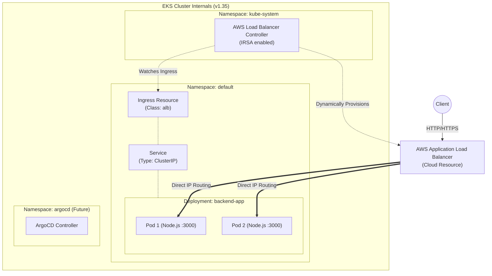

# Kubernetes Workloads & GitOps

This directory contains the resource definitions required to run the applications and cluster services. It utilizes Kustomize for configuration management and ArgoCD for continuous delivery.

## Kubernetes Internal Architecture

The following diagram illustrates the internal cluster topology, showing how traffic flows from the internet, how the AWS Load Balancer Controller interacts with Kubernetes resources, and how the application is deployed.

### Architecture Highlights

- **AWS Load Balancer Controller**: Running in `kube-system`, it watches for `Ingress` resources. When it detects our `backend-ingress`, it automatically talks to the AWS API and provisions an Application Load Balancer.
- **Direct Pod Routing (`target-type: ip`)**: Notice how the ALB routes traffic *directly* to the Pods, bypassing the `Service` layer entirely. This is achieved via the AWS VPC CNI and makes network routing much faster and more efficient.
- **Service (`ClusterIP`)**: The Service is still required as a logical grouping mechanism for the Ingress rules, but it does not proxy the external traffic.

## Directory Structure

- `argocd/`: GitOps controller configurations and application definitions.
- `base/`: Core Kubernetes manifests shared across environments (Deployments, Services, Ingress).
- `overlays/`: Environment-specific patches (e.g., dev, staging, prod).
