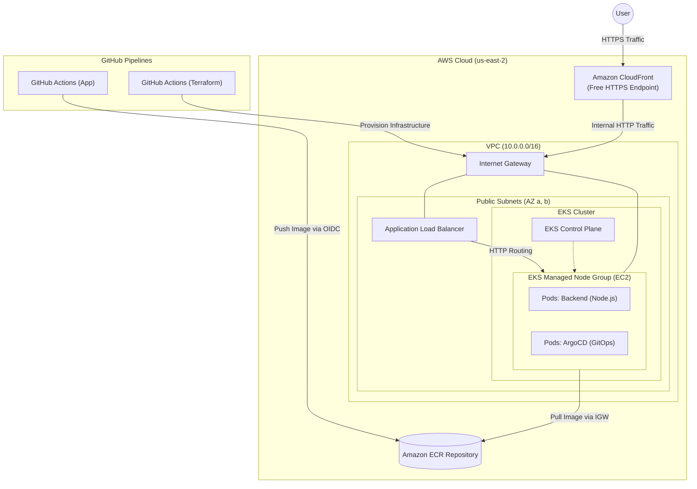

# Infrastructure as Code (Terraform)

This directory contains Terraform configurations used to provision the underlying infrastructure on AWS.

## Architecture Overview

The following diagram illustrates the network and cluster topology provisioned by Terraform:



## Network Design (Cost-Optimized & Scalable)

### 1. IP and Subnet Planning (CIDR Blocks)
To ensure high scalability (since each EKS Pod consumes a real VPC IP) and reserve space for future projects (like RDS databases or new clusters), the `10.0.0.0/16` VPC (65,536 IPs) is divided as follows:

| Resource / Subnet | CIDR Block | Available IPs | Purpose |
| :--- | :--- | :--- | :--- |
| **Entire VPC** | `10.0.0.0/16` | 65,536 | Global scope |
| **Public Subnet A** (us-east-2a) | `10.0.0.0/20` | 4,096 | EKS Nodes, ALB, Bastion |
| **Public Subnet B** (us-east-2b) | `10.0.16.0/20` | 4,096 | EKS Nodes, ALB, Bastion |
| *Public Reserve* | `10.0.32.0/19` | 8,192 | Reserved for future public resources |
| *Private Reserve 1* | `10.0.64.0/18` | 16,384 | Reserved for Databases (RDS/Cache) |
| *Private Reserve 2* | `10.0.128.0/17` | 32,768 | Reserved for future EKS clusters |

### 2. Public IPs and Cost Implications
For an instance to access the internet directly through the Internet Gateway (IGW) to pull images from ECR, it **must have a Public IPv4 address** assigned to it.

> **AWS Cost Notice:** As of February 2024, AWS charges `$0.005/hour` (approx. `$3.60/month`) for **every** public IPv4 address, regardless of whether it is an Elastic IP or dynamically auto-assigned to EKS instances.

Running 2 public Nodes incurs approximately **$7.20/month** in IP fees. Despite this fee, this architecture remains drastically cheaper than maintaining a NAT Gateway ($32/month) or multiple VPC Endpoints ($22/month).

### 3. Security Groups
Despite having public IPv4 addresses, security is strictly enforced via *Security Groups*. The EKS Nodes reject any inbound internet traffic that does not originate from the Application Load Balancer (ALB) or the EKS Control Plane.

- **Control Plane**: Managed by AWS (highly available).
- **Node Groups**: EC2 instances deployed in the Public Subnets (Amazon Linux 2023, x86_64).
- **Ingress Controller (Automated Addon)**: The cluster is automatically bootstrapped with the **AWS Load Balancer Controller** via Terraform (Helm Provider). This controller runs inside the cluster and dynamically provisions an AWS Application Load Balancer (ALB) whenever a Kubernetes `Ingress` resource is deployed, routing traffic directly to the Pod IPs. It uses IAM Roles for Service Accounts (IRSA) for secure, least-privilege AWS API access.

## HTTPS Strategy (No Custom Domain)

Since we do not own a custom domain to provision an ACM Certificate, the Application Load Balancer alone would only serve HTTP traffic. To securely provide HTTPS, we place **Amazon CloudFront** in front of the ALB. CloudFront automatically generates a secure, free HTTPS endpoint (e.g., `https://dxxxx.cloudfront.net`) and acts as a reverse proxy, forwarding traffic to the ALB over HTTP.

## IAM Permissions Required for GitHub Actions (Terraform)

For GitHub Actions to successfully execute `terraform apply` remotely via OIDC and provision this architecture (including IAM Roles for the cluster), the GitHub Service Role must be granted precise, least-privilege permissions.

**Strict Least Privilege Policy**
You must create a Customer Managed Policy containing the absolute minimum actions required for Terraform to manage EC2, EKS, and IAM components. Below is the required policy scope:

```json
{
    "Version": "2012-10-17",
    "Statement": [
        {
            "Effect": "Allow",
            "Action": [
                "ec2:*",
                "eks:*",
                "autoscaling:*",
                "iam:CreateRole",
                "iam:DeleteRole",
                "iam:AttachRolePolicy",
                "iam:DetachRolePolicy",
                "iam:PassRole",
                "iam:GetRole",
                "iam:ListInstanceProfiles",
                "iam:ListInstanceProfilesForRole",
                "iam:ListRolePolicies",
                "iam:ListAttachedRolePolicies",
                "iam:TagRole",
                "iam:UntagRole",
                "iam:CreateServiceLinkedRole",
                "iam:CreateOpenIDConnectProvider",
                "iam:DeleteOpenIDConnectProvider",
                "iam:GetOpenIDConnectProvider",
                "iam:TagOpenIDConnectProvider",
                "iam:UntagOpenIDConnectProvider",
                "iam:CreatePolicy",
                "iam:DeletePolicy",
                "iam:GetPolicy",
                "iam:GetPolicyVersion",
                "iam:ListPolicyVersions",
                "iam:TagPolicy",
                "iam:UntagPolicy"
            ],
            "Resource": "*"
        },
        {
            "Effect": "Allow",
            "Action": [
                "s3:PutObject",
                "s3:GetObject",
                "s3:ListBucket"
            ],
            "Resource": [
                "arn:aws:s3:::k8s-project-tfstate-*",
                "arn:aws:s3:::k8s-project-tfstate-*/*"
            ]
        }
    ]
}
```
*Note: The `iam:PassRole` permission is absolutely critical. Without it, Terraform cannot link the EKS Role to the EC2 Worker Nodes.*
